<!-- Generated: 2026-02-24 17:30:00 KST -->

# 엘리에셀 교회 관리 시스템
## 주요 기능 화면 소개 보고서

- **작성일:** 2026년 2월 24일
- **시스템 개요:** watching은 교회 교인 정보, 출결, 심방, 보고, 통계 등 교회 행정 업무 전반을 웹 기반으로 통합 관리하는 교회 관리 SaaS 플랫폼입니다.

---

## 목차

1. [처음 화면](#1-처음-화면)
2. [교인 관리](#2-교인-관리)
3. [출결 관리](#3-출결-관리)
4. [보고](#4-보고)
5. [심방](#5-심방)
6. [교육](#6-교육)
7. [봉사](#7-봉사)
8. [통계](#8-통계)
9. [일괄처리](#9-일괄처리)
10. [문자](#10-문자)
11. [게시판](#11-게시판)
12. [교구사역](#12-교구사역)
13. [프로그램 설정](#13-프로그램-설정)

---

## 1. 처음 화면

로그인 후 가장 먼저 표시되는 홈 화면입니다. 상단 검색창에서 교인 이름·아이디·핸드폰 번호로 빠르게 교인을 조회할 수 있으며, 교인 등록·교인 검색·심방 등록·심방 조회·기도 제목·프로그램 설정 등 자주 사용하는 메뉴의 바로가기 아이콘이 제공됩니다. 하단에는 전체 메뉴(사이트맵), 업데이트 내역, 동영상 매뉴얼, A/S 지원 링크가 안내됩니다.

### 1.1 로그인

시스템 접속을 위한 인증 화면입니다. 아이디와 패스워드를 입력하여 로그인하며, 로그인 성공 시 처음 화면으로 이동합니다.

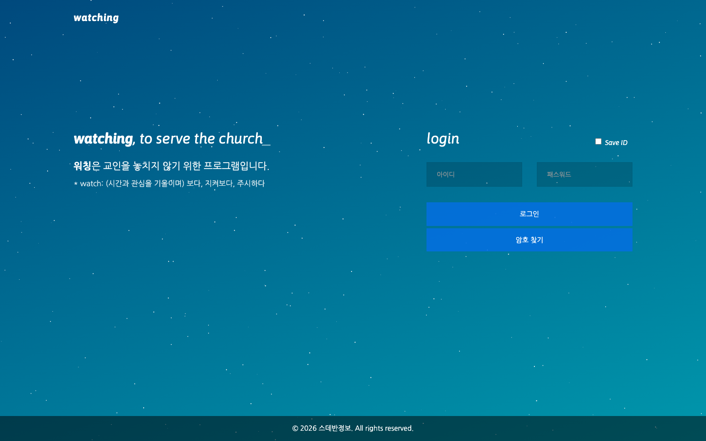

### 1.2 처음 화면 (홈)

로그인 직후 표시되는 메인 홈 화면입니다. 교인 빠른 검색창과 주요 기능 바로가기 아이콘을 중심으로 구성되어 있으며, 자주 사용하는 메뉴를 즐겨찾기로 등록하여 빠르게 접근할 수 있습니다.

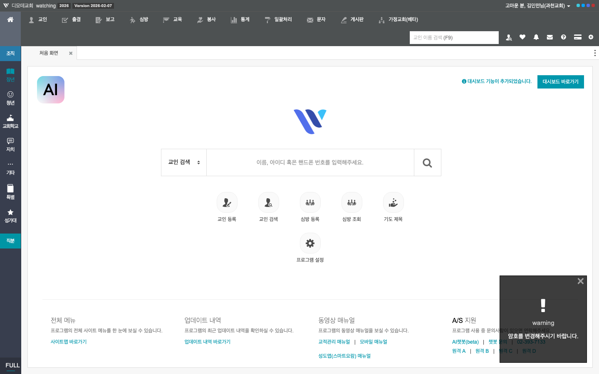

### 1.3 사이트맵

프로그램 전체 메뉴를 한눈에 확인할 수 있는 카드형 목록 화면입니다. 교인·출결·보고·심방·교육·봉사·통계·일괄처리·문자·게시판·교구사역 등 모든 기능 항목이 카테고리별로 정렬되어 있어 원하는 메뉴로 빠르게 이동할 수 있습니다.

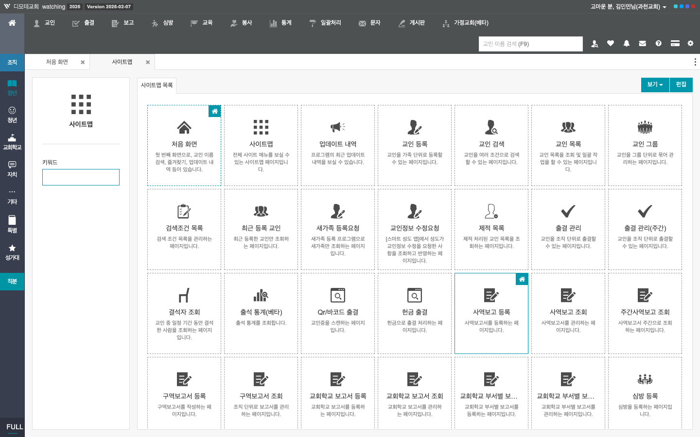

### 1.4 업데이트 내역

시스템의 기능 추가·수정·오류 수정 내역을 날짜 순으로 확인할 수 있는 화면입니다. 각 항목에는 변경 번호, 내용 요약, 적용 날짜가 표시되며 페이지네이션으로 이전 내역을 조회할 수 있습니다.

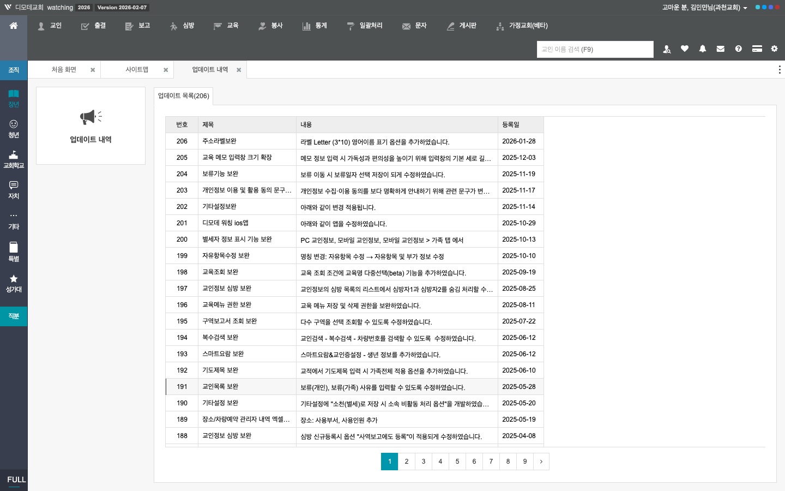

---

## 2. 교인 관리

교인 정보를 등록·검색·조회·관리하는 핵심 모듈입니다. 교인 등록(3단계 마법사), 다양한 조건의 교인 검색, 전체 교인 목록 조회, 그룹 관리, 저장된 검색조건 목록, 최근 등록된 교인 확인, 새가족 스마트 성도 앱 등록요청, 교인정보 수정요청 처리, 제적 처리된 교인 목록 등의 기능을 제공합니다.

### 2.1 교인 등록

기본 정보 → 추가 정보 → 등록 완료의 3단계 마법사(Wizard) UI로 새 교인을 등록합니다. 이름·성별·생년월일·연락처 등 기본 항목과 소속·직분·가족 관계 등 상세 항목을 단계적으로 입력할 수 있어 누락 없는 데이터 입력을 유도합니다.

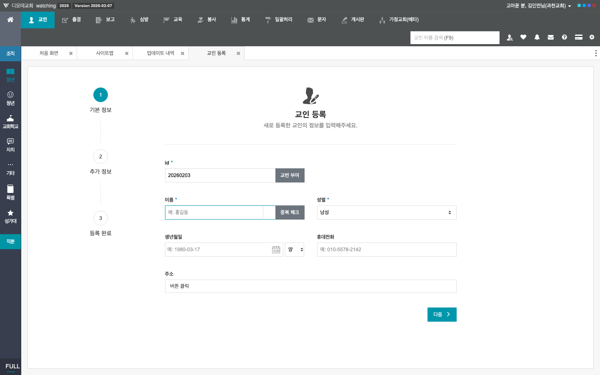

### 2.2 교인 검색

이름·성별·나이·소속·직분·생년월일·결혼 여부·지역 등 다양한 조건을 조합하여 원하는 교인을 정밀하게 검색하는 화면입니다. 검색 조건은 저장하여 재사용할 수 있습니다.

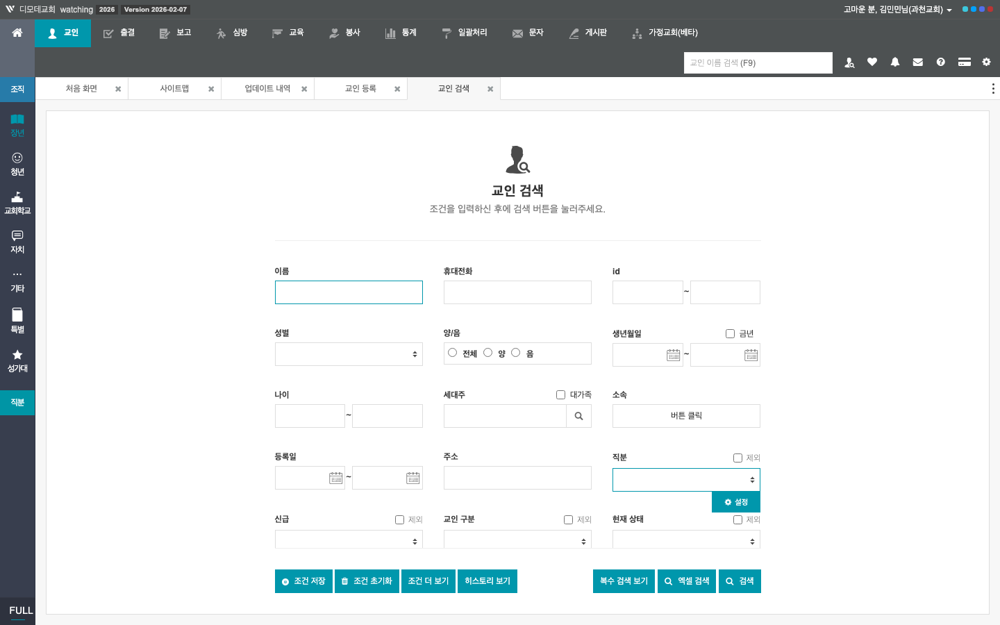

### 2.3 교인 목록

좌측 조직 트리에서 소속 부서를 선택하면 해당 부서의 교인 목록이 우측 테이블에 표시됩니다. 교인 구분(장년·청년·교회학교 등) 필터와 함께 엑셀 내보내기, 인쇄 기능을 제공합니다.

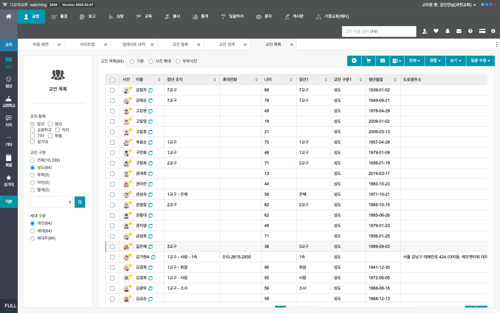

### 2.4 교인 그룹

관리자가 직접 정의한 교인 그룹을 관리하는 화면입니다. 그룹명, 공개 범위, 소속 인원수를 목록으로 확인하고 신규 그룹 생성 및 기존 그룹 수정·삭제가 가능합니다.

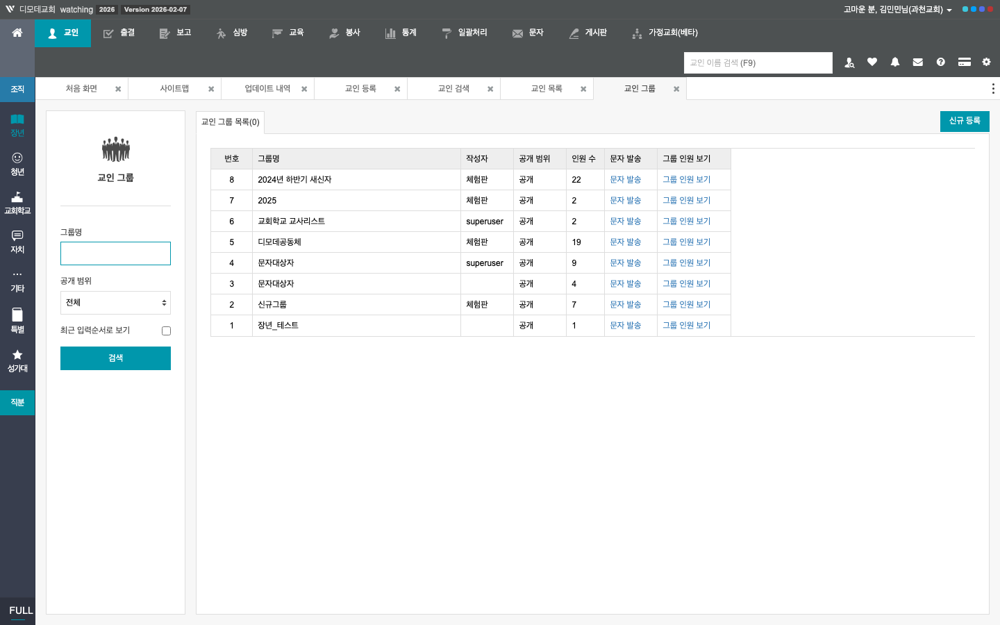

### 2.5 검색조건 목록

교인 검색에서 자주 사용하는 복잡한 검색 조건을 저장하고 재사용할 수 있는 화면입니다. 저장된 조건의 이름·설명·등록일을 확인하고 즉시 검색에 적용할 수 있습니다.

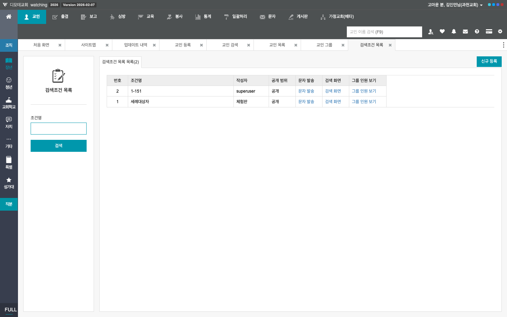

### 2.6 최근 등록 교인

기간 조건을 설정하여 해당 기간 내에 새로 등록된 교인을 조회하는 화면입니다. 새가족 정착 현황 파악 및 후속 관리에 활용됩니다.

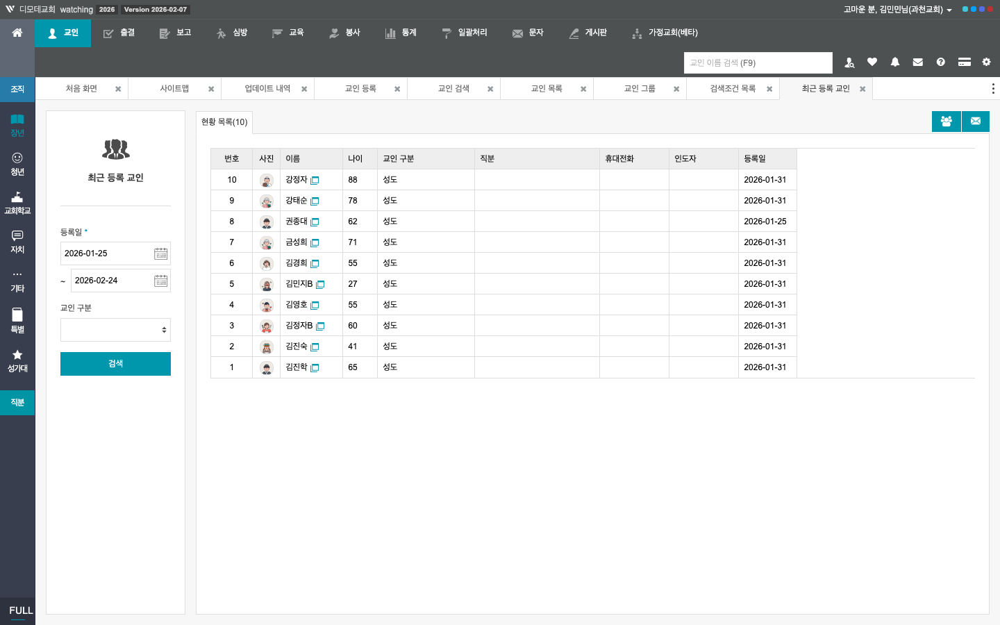

### 2.7 새가족 등록요청

스마트 성도 앱을 통해 새가족이 직접 제출한 등록요청 목록을 관리하는 화면입니다. 요청 내용을 검토한 후 승인하여 교인으로 정식 등록하거나 반려할 수 있습니다.

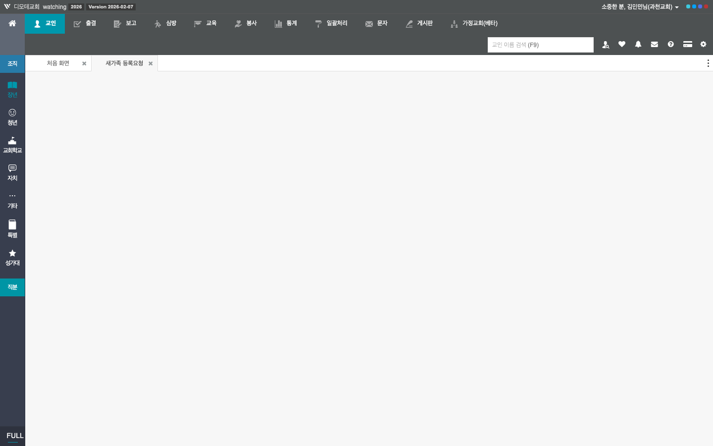

### 2.8 교인정보 수정요청

교인이 스마트 성도 앱을 통해 직접 제출한 개인정보 수정 요청을 관리하는 화면입니다. 기존 데이터와 변경 요청 내용을 비교하여 승인 또는 반려 처리합니다.

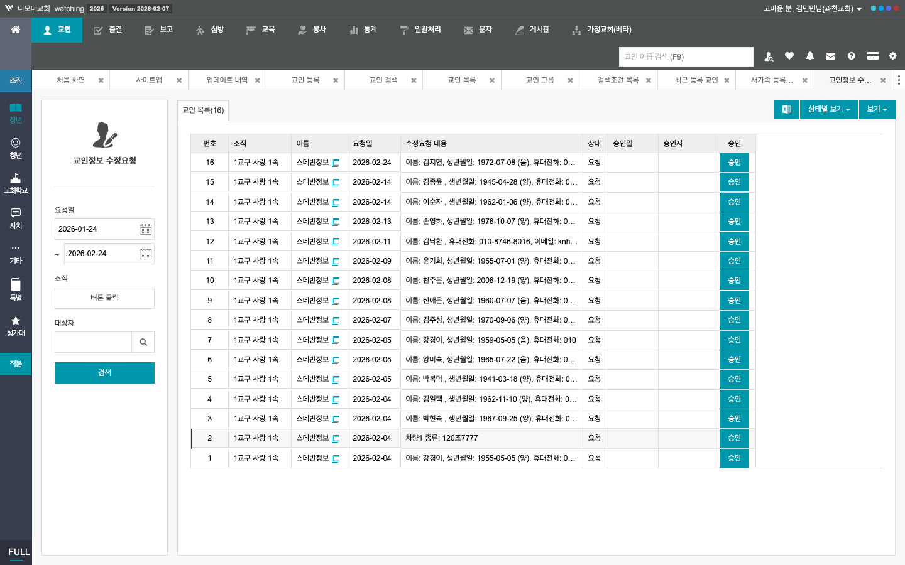

### 2.9 제적 목록

교회를 이적하거나 제적 처리된 교인을 조회하는 화면입니다. 제적 사유·기간·소속 조건으로 검색할 수 있으며, 필요 시 복적 처리도 가능합니다.

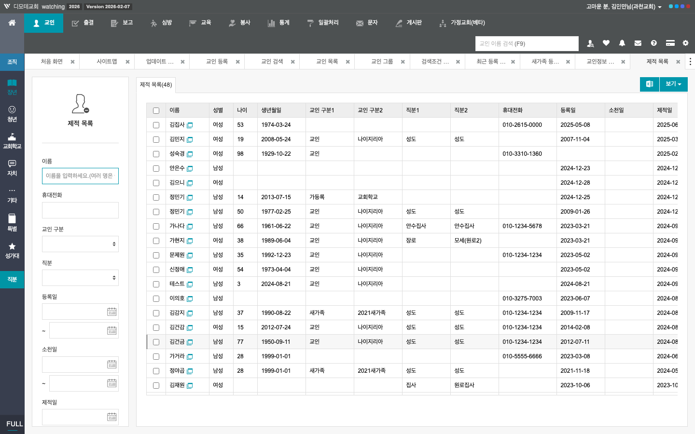

---

## 3. 출결 관리

교인의 예배 출석 여부를 기록하고 조회하는 모듈입니다. 연도·단기·예배별 필터로 출결 데이터를 검색하고, 주간 단위 출결 관리, 결석자 조회, 출석 통계, QR/바코드 스캔 출결, 헌금 출결 기능을 제공합니다.

### 3.1 출결 관리

연도, 단기(월), 출결 날짜 범위, 조직, 예배 구분, 교인 구분, 현재 상태 등 다양한 필터를 조합하여 출결 데이터를 검색하고 목록으로 조회합니다. 출석 등록·수정, 엑셀 업로드·내보내기, 인쇄 기능을 제공합니다.

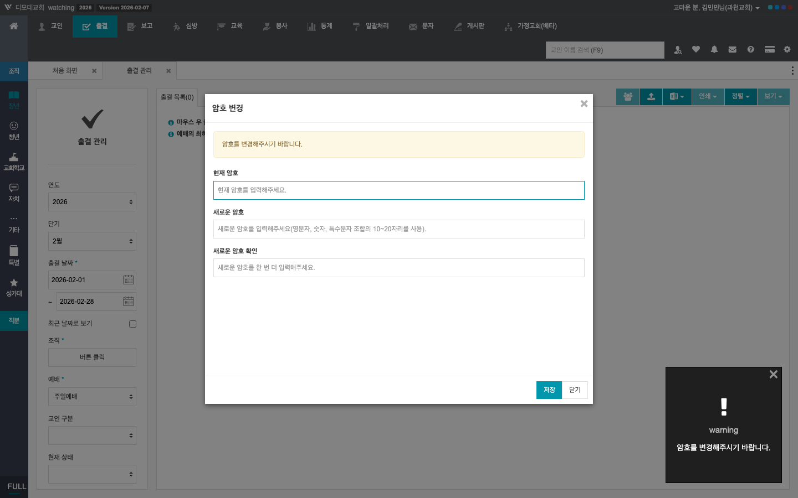

### 3.2 출결 관리(주간)

특정 날짜를 기준으로 주간 단위 출결 현황을 조회하는 화면입니다. 조직, 교인 구분, 현재 상태, 출석 여부 필터와 함께 소속별·봉사별 구분 조회가 가능합니다.

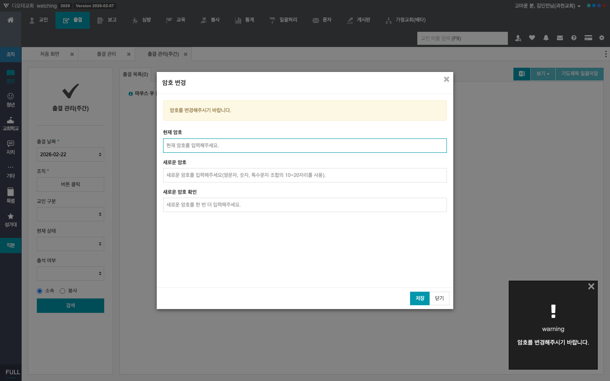

### 3.3 결석자 조회

연도·단기·기간·조직·예배·교인 구분 조건으로 결석자 목록을 검색합니다. "검색기간 전 주 출석" 옵션을 활용하면 직전 주에 출석했던 교인 중 결석자를 필터링하여 연속 결석자를 빠르게 파악할 수 있습니다.

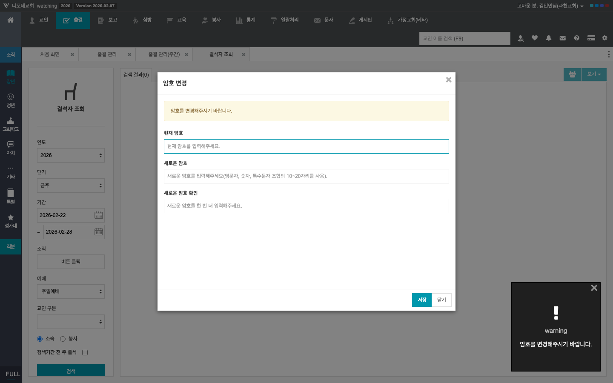

### 3.4 출석 통계 (베타)

연도·단기·날짜 범위·조직·예배·교인 구분·현재 상태 조건으로 출석 통계 데이터를 조회합니다. 기간별 출석률 변화를 분석하는 데 활용됩니다.

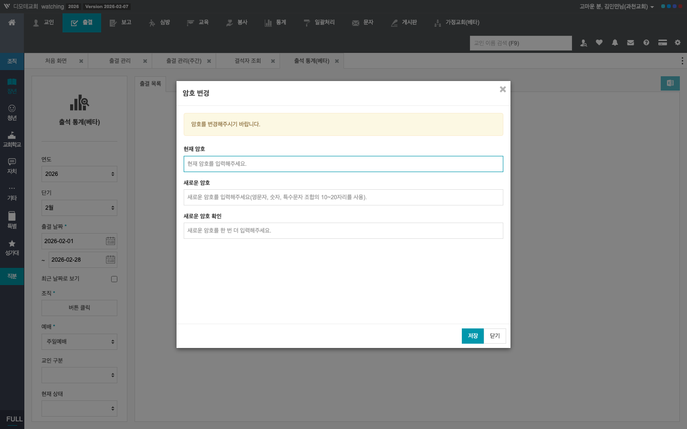

### 3.5 QR/바코드 출결

예배 현장에서 교인의 QR코드 또는 바코드를 스캔하여 실시간으로 출결을 처리하는 화면입니다. 예배 구분, 출석일, 입구 위치를 설정하고 스캔 시 알림음·인원 조회·생일 표시 등의 옵션을 선택할 수 있습니다.

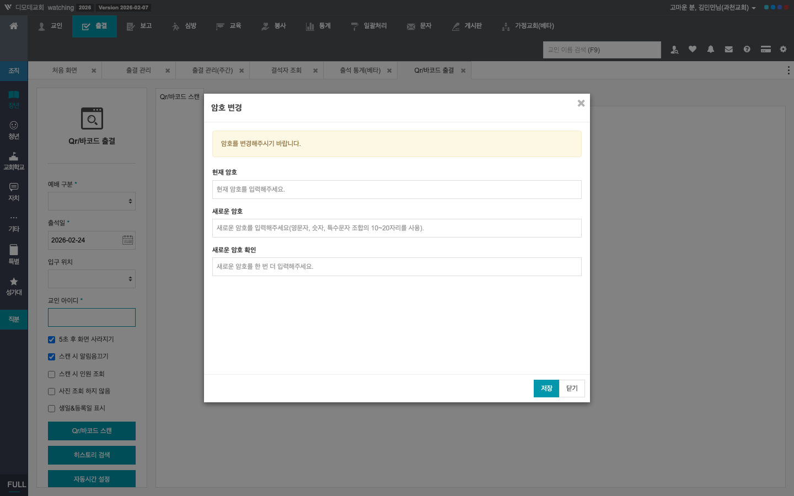

### 3.6 헌금 출결

헌금일 기준으로 헌금 출결 목록을 조회하고 일괄 처리하는 화면입니다. 헌금 납부 여부와 출석 정보를 연계하여 관리합니다.

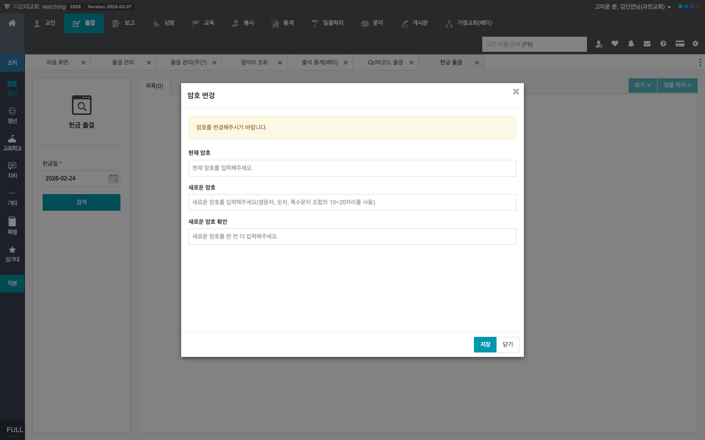

---

## 4. 보고

교역자 및 소그룹 리더의 사역 활동을 보고하고 조회하는 모듈입니다. 사역보고(개인·주간), 구역보고서, 교회학교 보고서를 단계별 입력 폼(기본 정보 → 추가 정보 → 등록 완료)으로 등록하고, 기간·조직·담당자별 조건 검색으로 보고서를 조회할 수 있습니다.

### 4.1 사역보고 등록

3단계 위저드(기본 정보 → 추가 정보 → 등록 완료)로 사역보고를 작성합니다. 날짜, 조직, 사역 내용을 단계별로 입력하여 등록합니다.

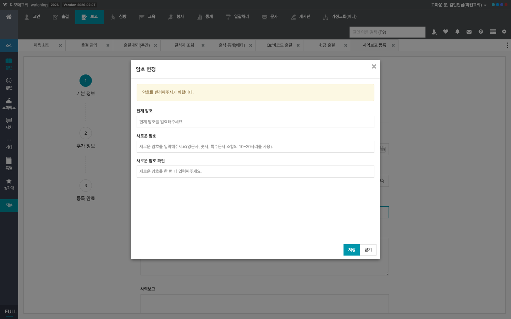

### 4.2 사역보고 조회

구분, 보고일 범위, 보고자, 키워드 조건으로 등록된 사역보고를 검색하고 목록으로 조회합니다. 인쇄 및 엑셀 내보내기 기능을 제공합니다.

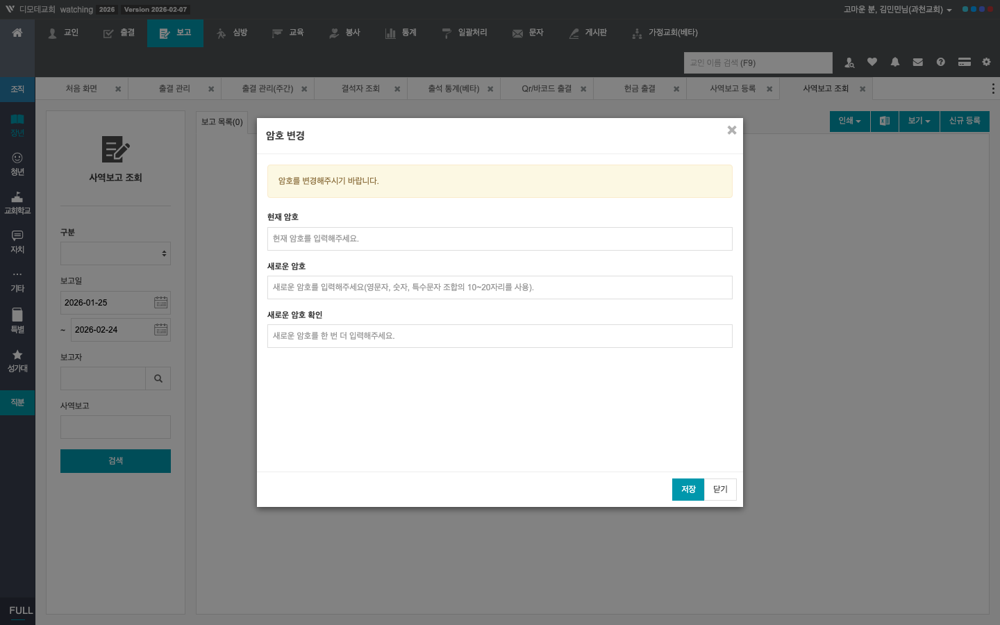

### 4.3 주간사역보고 조회

보고일(주간 단위) 기준으로 사역보고 목록을 요일별 컬럼으로 표시하여 한 주간의 사역 활동을 한눈에 파악할 수 있습니다.

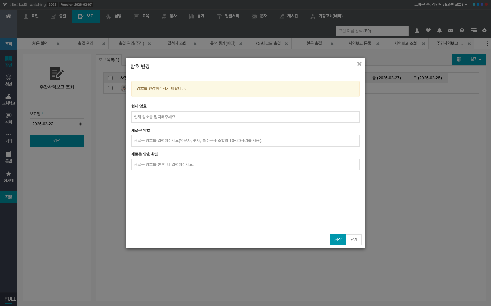

### 4.4 구역보고서 등록

3단계 위저드(기본 정보 → 추가 정보 → 등록 완료)로 구역 모임 보고서를 작성합니다. 조직, 모임 일자, 인도자, 장소, 참석자 수, 구역일기 등을 입력합니다.

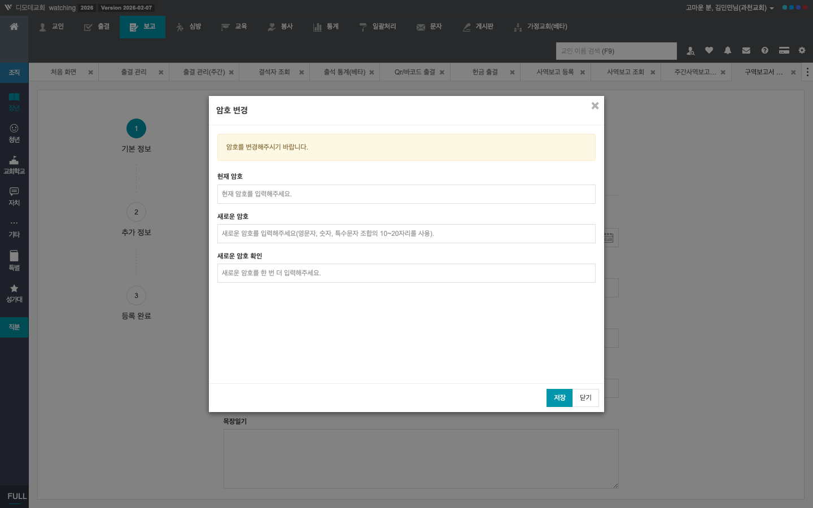

### 4.5 구역보고서 조회

연도, 조직, 모임 일자 범위, 교인 구분 조건으로 구역보고서를 검색하고 조회합니다. 새가족·참석 가정 수·사역 신청 현황을 목록에서 확인할 수 있습니다.

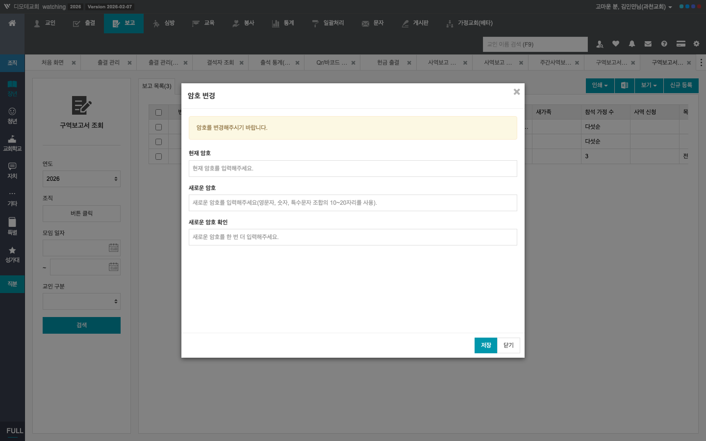

### 4.6 교회학교 보고서 등록

3단계 위저드(기본 정보 → 출석 정보 → 등록 완료)로 교회학교 출석 보고서를 등록합니다. 날짜, 부서, 출석 정보를 단계별로 입력합니다.

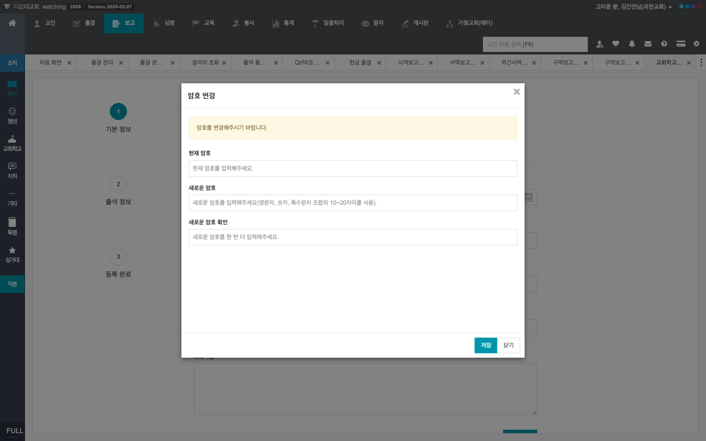

### 4.7 교회학교 보고서 조회

연도, 조직, 예배 일자 범위 조건으로 교회학교 보고서를 검색하고 목록으로 조회합니다. 인쇄 및 신규 등록 기능을 제공합니다.

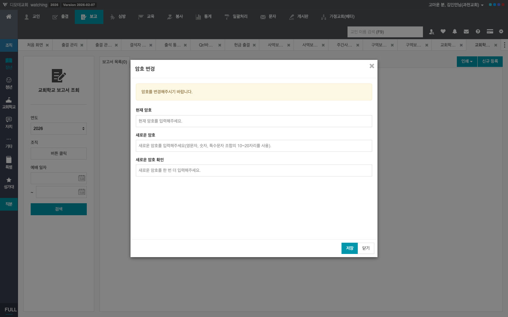

---

## 5. 심방

교인 심방을 등록하고 조회하는 기능을 제공합니다. 심방 등록 시 대상자, 심방일, 심방 구분, 심방 종류, 심방자 정보를 단계별로 입력하며, 심방 조회에서는 대상자·심방자·조직·심방 구분·종류·기간·내용 등 다양한 조건으로 검색할 수 있습니다. 미심방 세대 검색을 통해 특정 기간 동안 심방받지 못한 세대를 확인하고, 기도 제목 기능으로 교인의 기도 제목을 등록·관리할 수 있습니다.

### 5.1 심방 등록

심방 대상자, 심방일, 심방 구분(개인·가정·병원 등), 심방 종류(개업·결혼·장례 등), 심방자 정보를 단계별로 입력하여 심방 기록을 등록합니다.

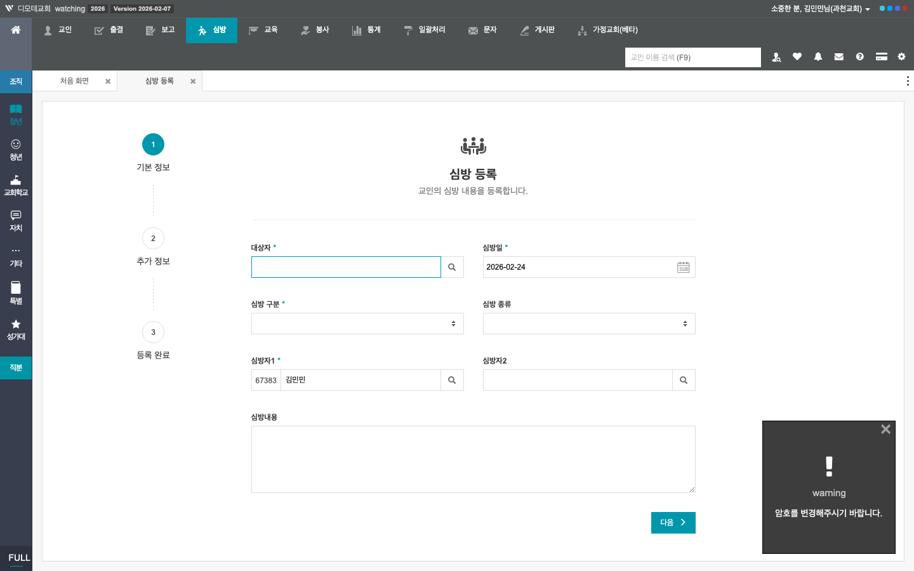

### 5.2 심방 조회

대상자, 심방자, 조직, 심방 구분, 심방 종류, 기간, 내용 키워드 등 다양한 조건으로 등록된 심방 기록을 검색하고 조회합니다.

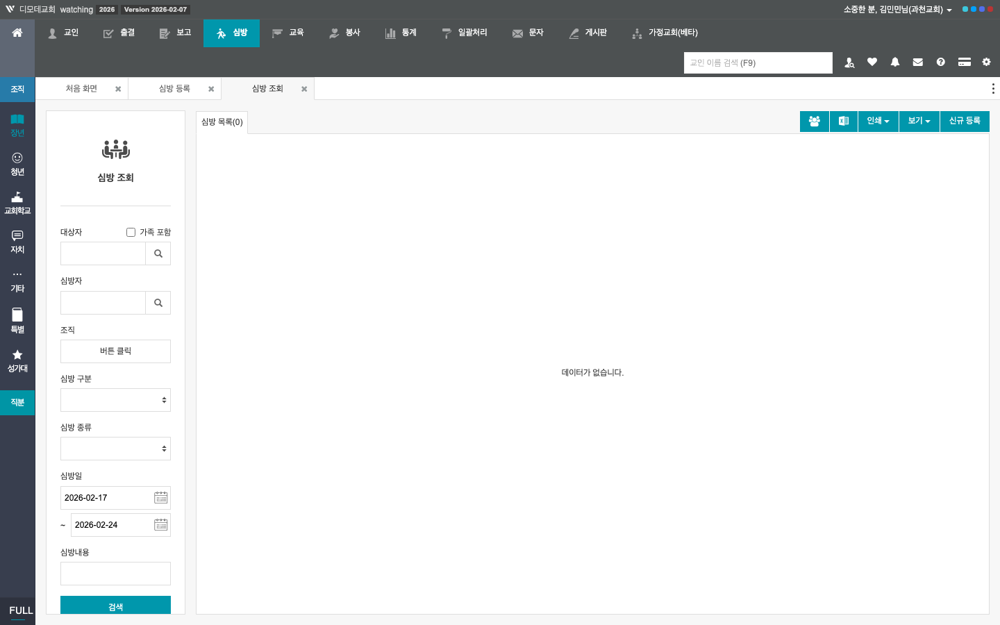

### 5.3 미심방 세대 검색 (베타)

특정 기간 내에 심방받지 못한 세대를 검색하는 화면입니다. 미심방 세대를 파악하여 목회적 관리의 사각지대를 방지하는 데 활용됩니다.

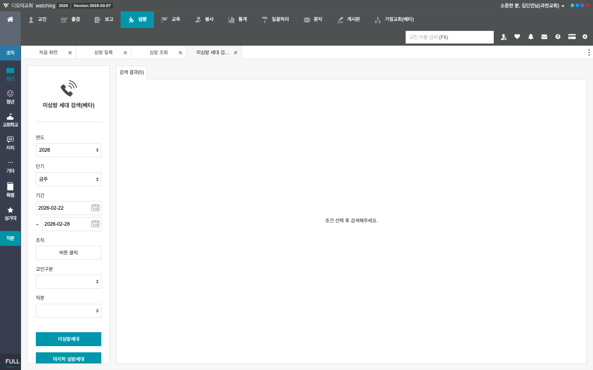

### 5.4 기도 제목

교인의 기도 제목을 등록하고 관리하는 화면입니다. 담당 교역자나 소그룹 리더가 기도 제목을 기록하고 중보기도 활동에 활용합니다.

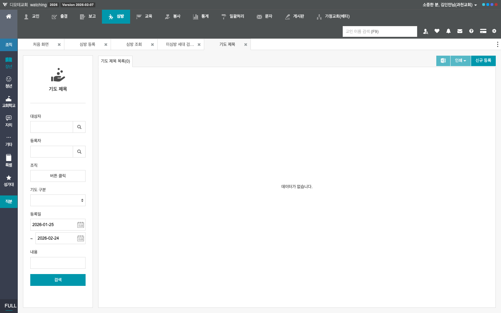

---

## 6. 교육

교인의 교육 이력을 등록하고 조회하는 기능을 제공합니다. 교육 등록 시 대상자, 교육 기간(시작~종료), 교육명, 수료 여부를 단계별로 입력하며, 교육 조회에서는 등록된 교육 이력을 교인명·기간·조직·교육명 등의 조건으로 검색할 수 있습니다. 프로그램 설정에서 세례·제자훈련·기도훈련 등 교육 과정 항목을 사전에 정의하여 사용합니다.

### 6.1 교육 등록

교육 대상자, 교육 기간(시작~종료일), 교육명, 수료 여부를 단계별로 입력하여 교인의 교육 이력을 등록합니다.

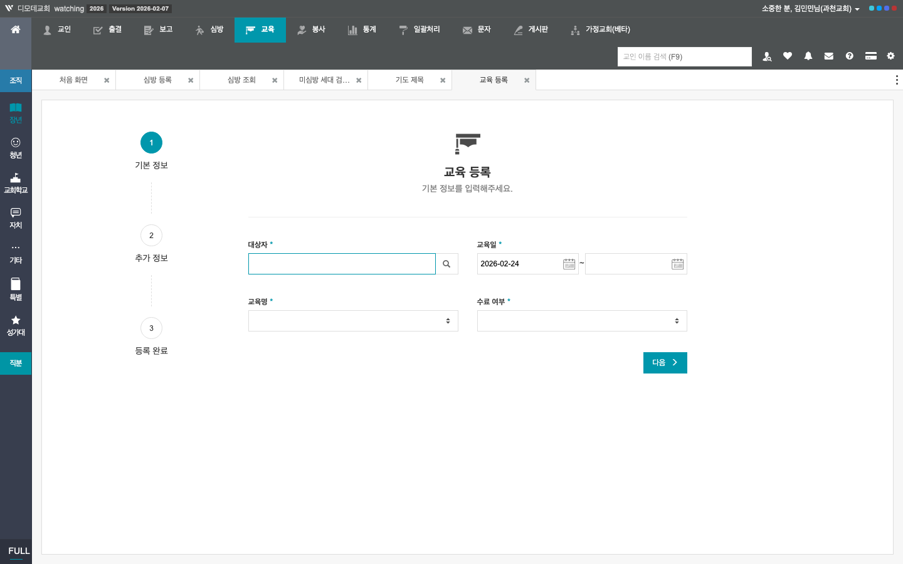

### 6.2 교육 조회

교인명, 기간, 조직, 교육명, 수료 여부 등의 조건으로 등록된 교육 이력을 검색하고 목록으로 조회합니다. 엑셀 내보내기 기능을 제공합니다.

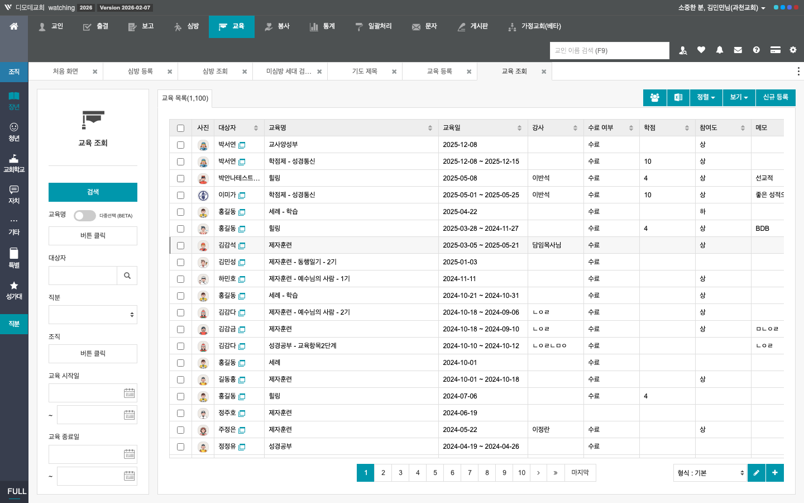

---

## 7. 봉사

교회 봉사자를 등록하고 조회하는 기능을 제공합니다. 봉사자 등록 시 교인 이름, 임명일, 연도, 조직, 직책, 활동 여부를 입력하여 저장하며, 봉사자 조회에서는 연도·조직·교인 이름·직책·활동 여부 등의 조건으로 검색하고 봉사자 목록(사진·이름·연도·조직·직책·활동 여부·임명일)을 테이블 형태로 확인할 수 있습니다.

### 7.1 봉사자 등록

교인 이름, 임명일, 연도, 조직, 직책, 활동 여부를 입력하여 봉사자를 등록합니다. 교회 내 각종 봉사 역할(찬양팀·주차·안내·미디어 등)을 체계적으로 관리할 수 있습니다.

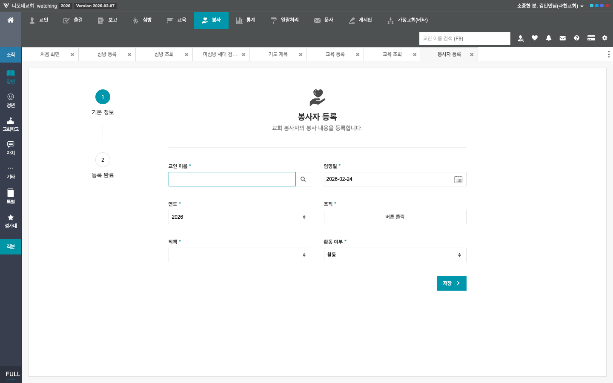

### 7.2 봉사자 조회

연도, 조직, 교인 이름, 직책, 활동 여부 조건으로 봉사자를 검색하고 사진·이름·조직·직책·임명일이 포함된 목록을 확인합니다.

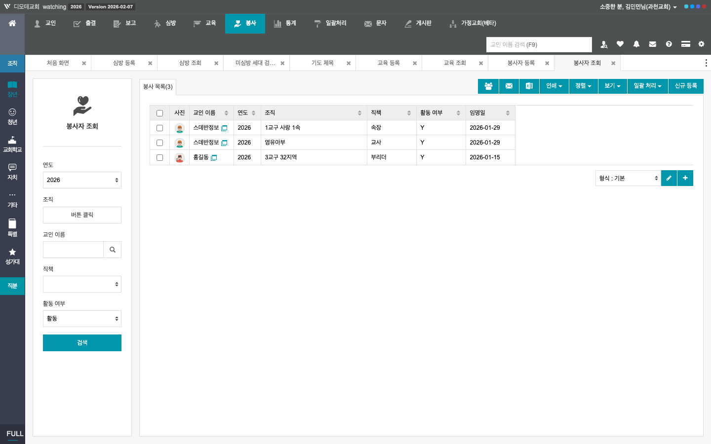

---

## 8. 통계

교회 운영 전반에 걸친 다양한 통계를 시각화하여 제공하는 모듈입니다. 출석률, 새신자 현황, 심방 활동, 환경별 접속 통계 등을 차트와 테이블로 분석할 수 있어 교회 성장 현황 파악 및 의사결정에 활용됩니다.

### 8.1 전체 통계

출석률 원형 차트, 연도별 새신자 현황, 주일예배 평균 출석수, 새신자 정착 통계 등 교회 핵심 지표를 종합적으로 시각화한 화면입니다.

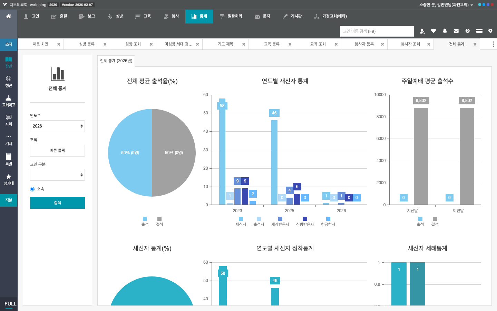

### 8.2 예배 통계

조직·예배 구분·기간 조건으로 출석 데이터를 조회하며, 조직항목별·조직 출결·세부 출결·개인별 탭으로 세분화된 출석 현황을 분석합니다.

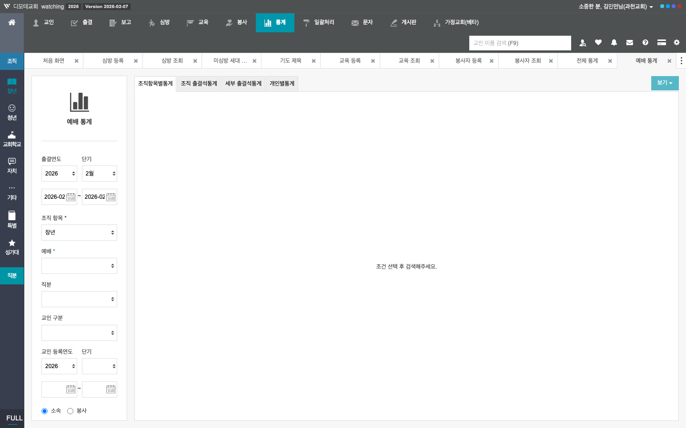

### 8.3 연간 월별 교인수 통계 (베타)

연도와 통계 항목(등록·제적·세례 등)을 선택하여 월별 교인수 변화 추이를 조회합니다. 연간 교인 증감 현황을 파악하는 데 활용됩니다.

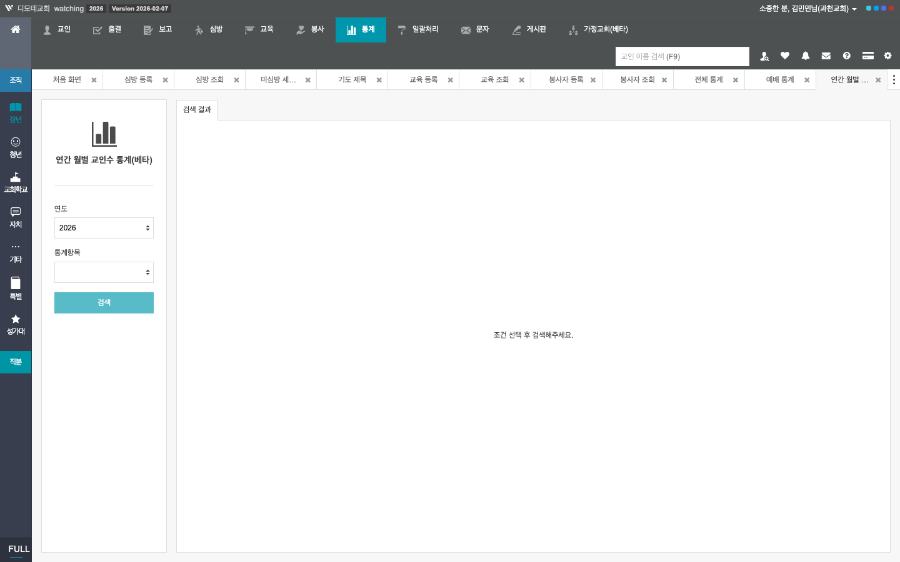

### 8.4 새신자 통계

기간·조직·교인 구분·신급·직분 조건으로 새신자 현황을 검색하고 분석합니다. 새신자 유입 경로 및 정착률 파악에 활용됩니다.

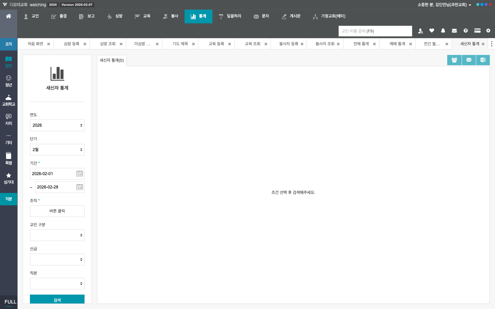

### 8.5 장년 통계

출결·심방·교육·봉사 탭으로 구분하여 장년 교인의 활동 현황을 종합적으로 제공합니다. 개인별 영적 성장 현황을 다각도로 분석할 수 있습니다.

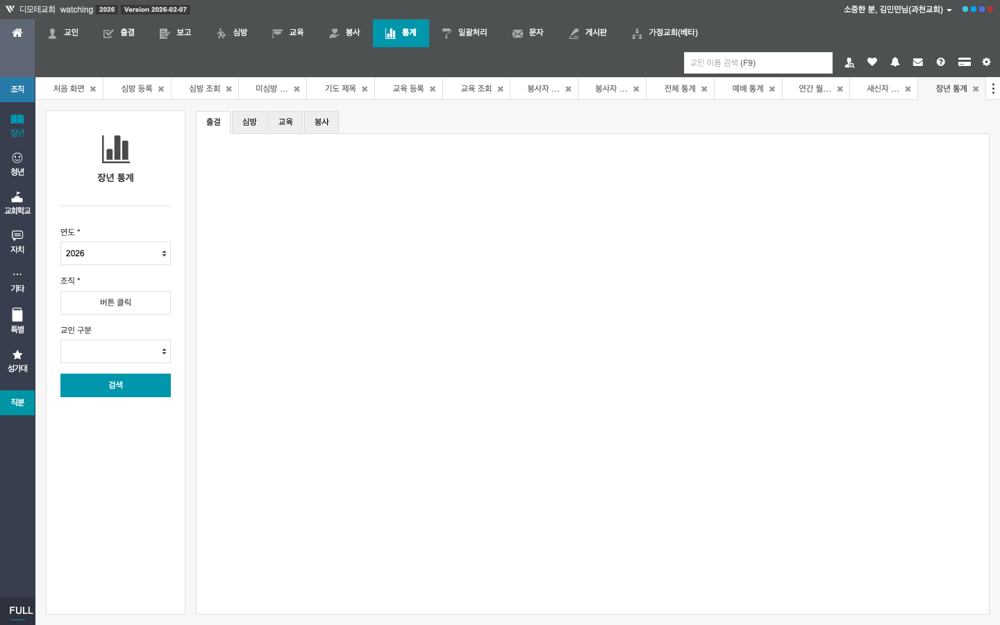

### 8.6 심방 종류 통계

심방자별로 개업·결혼·병문안·위로·장례·출산 등 심방 유형별 건수를 테이블 형태로 집계합니다. 심방 사역의 종류별 현황을 파악할 수 있습니다.

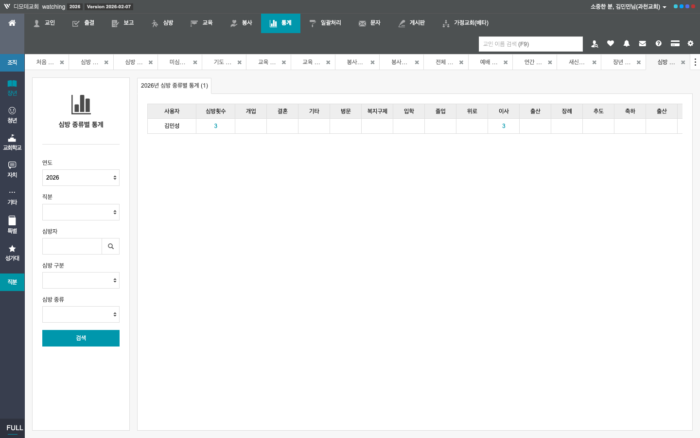

### 8.7 월별 심방 통계

심방자별 월별 심방 횟수를 연간 12개월 표로 제공합니다. 심방자별 활동 현황과 계절별 심방 패턴을 분석할 수 있습니다.

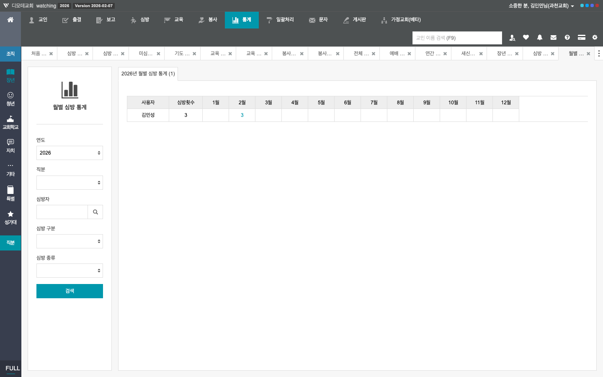

### 8.8 접속 환경 통계

운영체제와 브라우저 조합별 접속 수·비율·마지막 접속 일시를 목록으로 제공합니다. 교인들의 디바이스 환경을 파악하여 UI/UX 개선에 활용합니다.

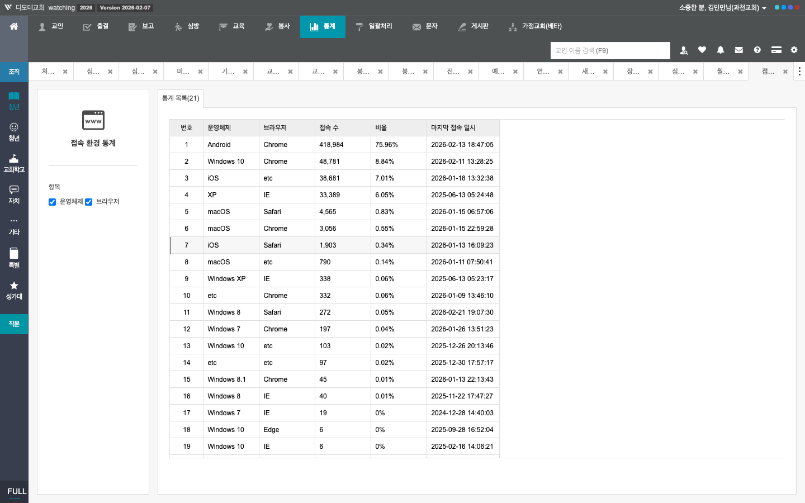

---

## 9. 일괄처리

엑셀 파일을 업로드하여 교인의 교적·소속·봉사·직분·교육·사용자 데이터를 일괄로 입력하거나, 가족 업데이트·배우자 교번 적용·나이 갱신·생일 갱신·소속 내역 복사 등 다양한 데이터 일괄 처리 작업을 실행할 수 있습니다. 연초 데이터 정비나 대량 데이터 이관 시 유용하게 활용됩니다.

### 9.1 엑셀 데이터 입력

교적·소속·봉사·직분·교육·사용자 구분 중 처리할 데이터 종류를 선택하고, 지정된 양식의 엑셀 파일을 업로드하여 대량 데이터를 일괄 등록합니다.

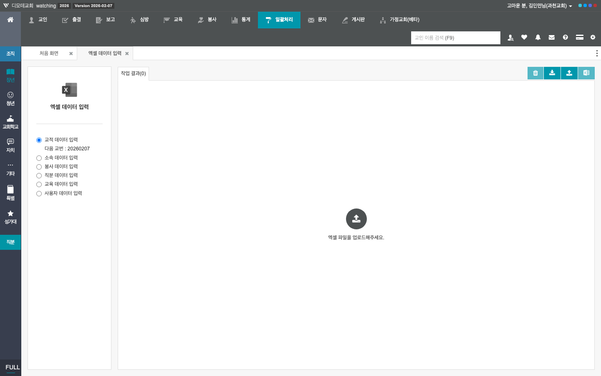

### 9.2 일괄 데이터 처리

가족 업데이트, 배우자 교번·직분 일괄 적용, 나이·생일 갱신, 소속 내역 연도별 복사 등 연초 정기 작업을 버튼 클릭 한 번으로 일괄 실행합니다.

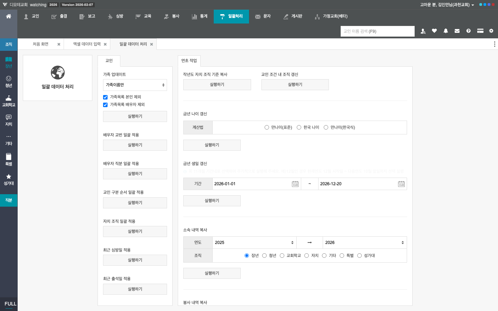

---

## 10. 문자

교인에게 SMS/LMS 문자를 발송하고 발송 내역을 조회하는 메뉴입니다. 교적 데이터와 연동하여 특정 조직·그룹의 교인에게 단체 문자를 발송할 수 있으며, 발송 이력은 기간·발신번호·수신번호·내용·결과 조건으로 검색할 수 있습니다. 문자 서비스는 별도 신청이 필요합니다 (기본료 11,000원/월, SMS 16.5원/건, LMS 38.5원/건).

### 10.1 문자 발송

교적 데이터와 연동하여 대상 교인을 선택하고 SMS/LMS 문자를 발송합니다. 서비스 미가입 교회에는 신청 안내(이용요금·제출서류)가 표시됩니다.

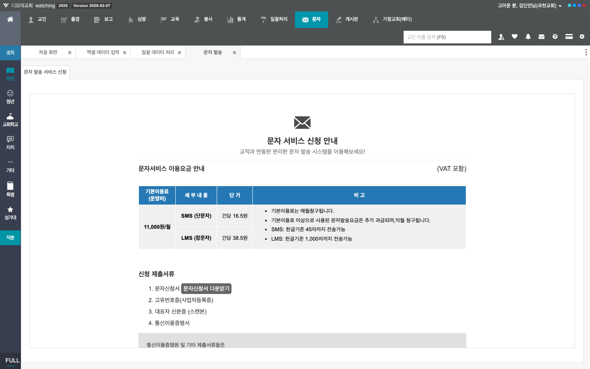

### 10.2 문자 발송 내역

기간, 발신번호, 수신번호, 내용 키워드, 사용자, 발송 결과 조건으로 문자 발송 이력을 검색하고 조회합니다.

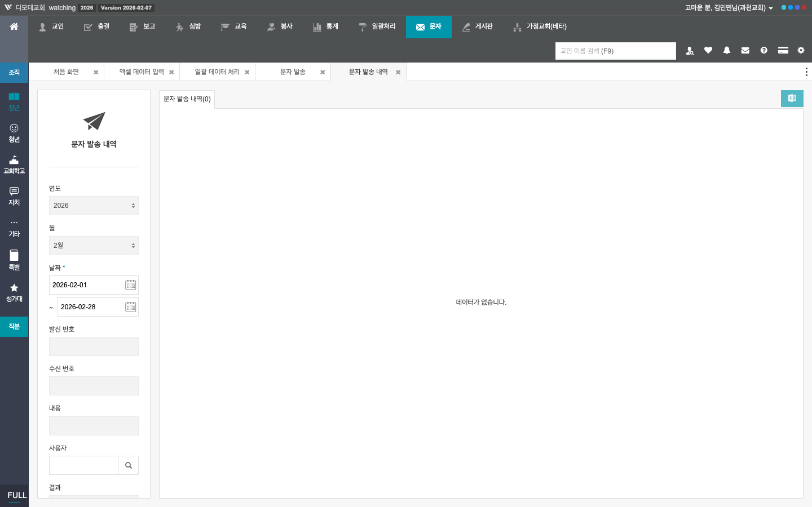

---

## 11. 게시판

교회 내 다양한 게시판을 통해 공지사항, 자유게시판, 경조/행사, 교회일정, 교인 기념일 검색, 월별 생일자 달력, 개인 메모/다이어리 기능을 제공합니다. 경조/행사·교회일정·생일 달력은 월별 달력 형태로 표시되며, 날짜별 등록 및 조회가 가능합니다.

### 11.1 공지사항

교회 운영 관련 공지사항을 등록하고 조회하는 게시판입니다. 제목·내용 조건 검색과 스마트 성도 앱 공지사항 연동 기능을 제공합니다.

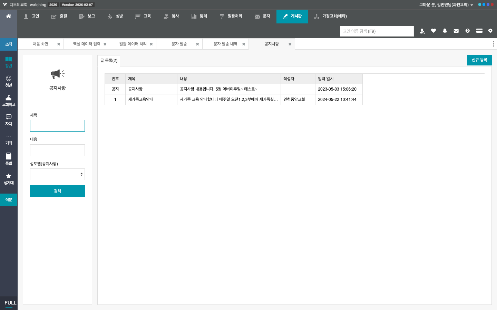

### 11.2 자유게시판

교인 누구나 자유롭게 글을 작성하고 소통할 수 있는 게시판입니다. 제목·내용 키워드 검색을 지원합니다.

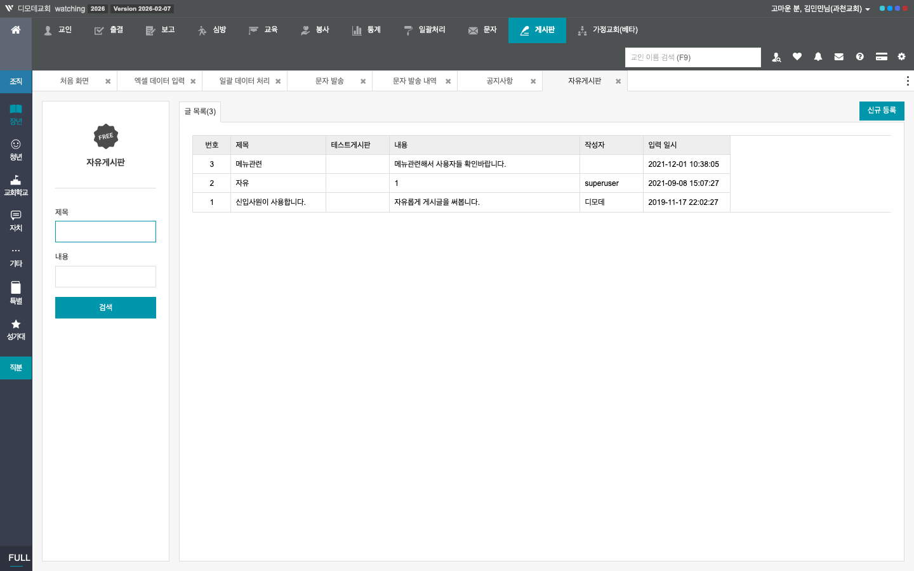

### 11.3 경조/행사

연도·월을 선택하면 해당 월의 달력에 경조·행사 일정이 표시됩니다. 날짜를 클릭하여 경조·행사를 신규 등록하거나 기존 항목을 수정·삭제할 수 있습니다.

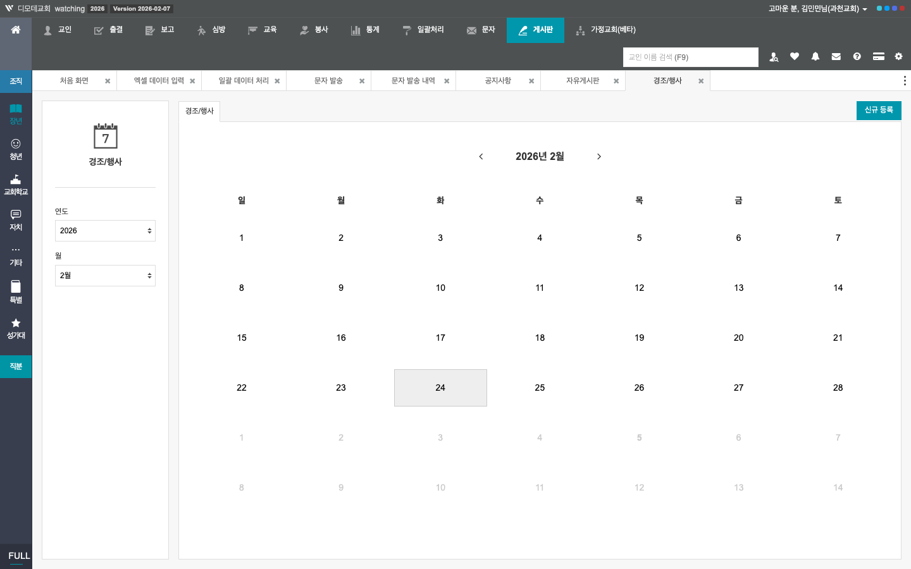

### 11.4 교회일정

연도·월을 선택하면 해당 월의 달력에 교회 공식 일정이 표시됩니다. 예배·행사·모임 등 교회 전체 일정을 달력 형태로 관리합니다.

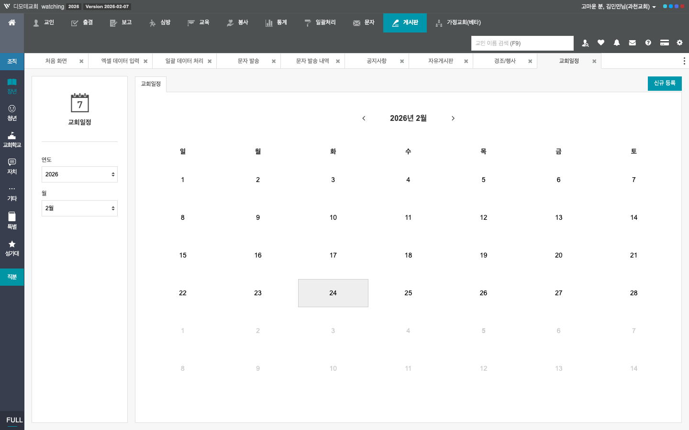

### 11.5 교인 기념일 검색

생일·결혼기념일 등 교인의 기념일을 조직별 필터로 검색하고 목록으로 확인합니다. 기념일을 앞둔 교인에게 축하 연락을 취하는 데 활용됩니다.

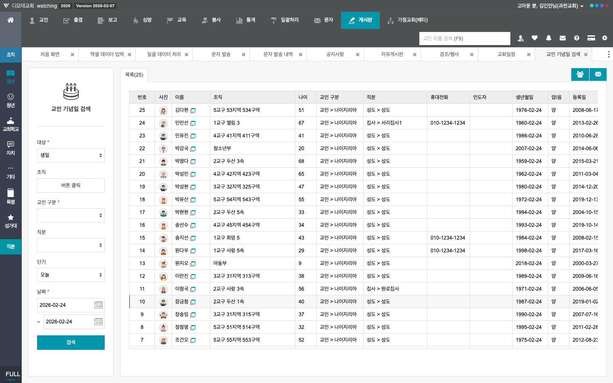

### 11.6 월별 기념일 (생일자)

연도·월·대상(생일/결혼기념일)·조직·교인 구분을 선택하면 해당 월의 달력에 기념일 대상 교인이 표시됩니다. 월별 생일자 목록을 한눈에 파악할 수 있습니다.

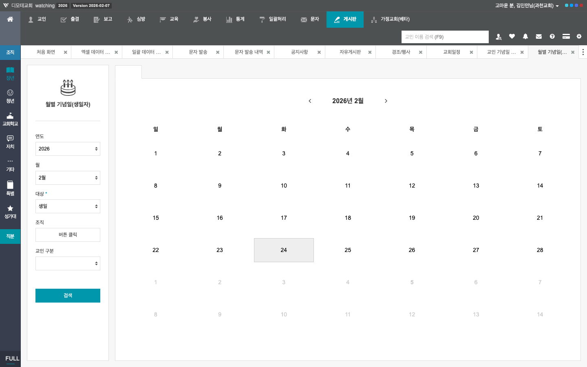

### 11.7 My Memo/Diary

개인 메모(나만 보기)와 공유 메모(교역자·관리자 공유) 탭으로 구성된 다이어리입니다. 월별 달력에서 날짜를 선택하여 메모를 작성하고 관리합니다.

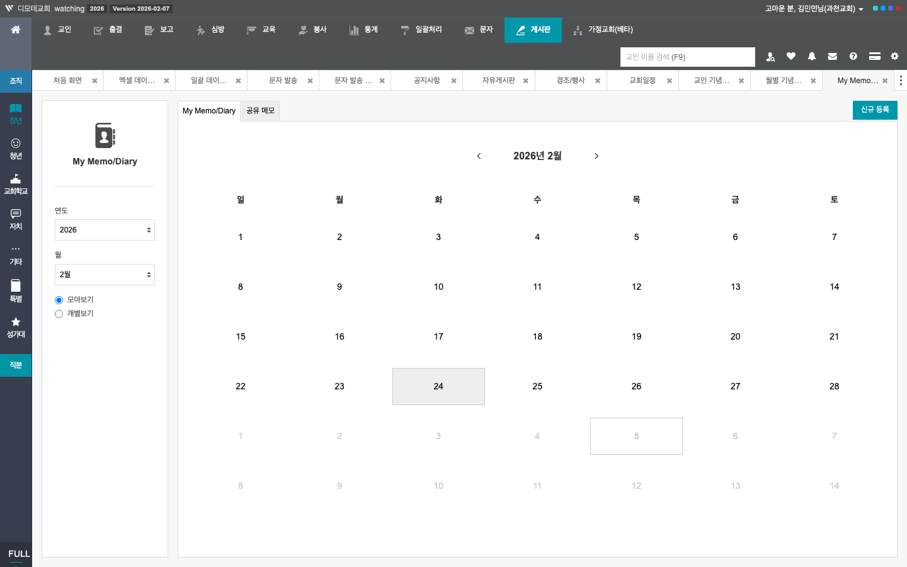

---

## 12. 교구사역

교구사역(구역) 운영을 지원하는 메뉴입니다. 구역의 기본 정보(구역명·목자·초원·평원·소속목원)를 조회하고, 구역보고서 등록 및 조회, 목원의 은사를 등록·조회하는 기능을 제공합니다. 현재 베타 서비스로 운영 중이며, 구역 중심 교회 운영 체계를 지원합니다.

### 12.1 일반사항

조직을 선택하면 해당 구역의 기본 정보(구역명·목자·예비목자·어린이목자·초원·평원·소속 목원 수·구역진도 대상자·미성년자 현황)를 조회합니다.

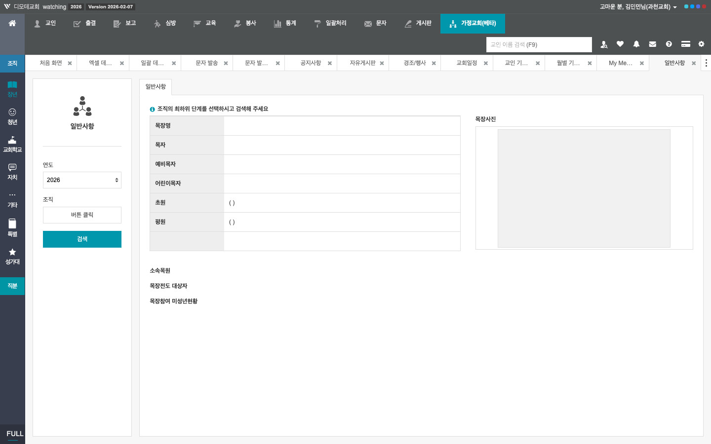

### 12.2 구역보고서 등록

조직, 모임 일자, 인도자, 장소, 기도, 새가족, 참석 가정 수, 사역 신청, 구역일기 항목을 단계별로 입력하여 구역(구역) 모임 보고서를 등록합니다.

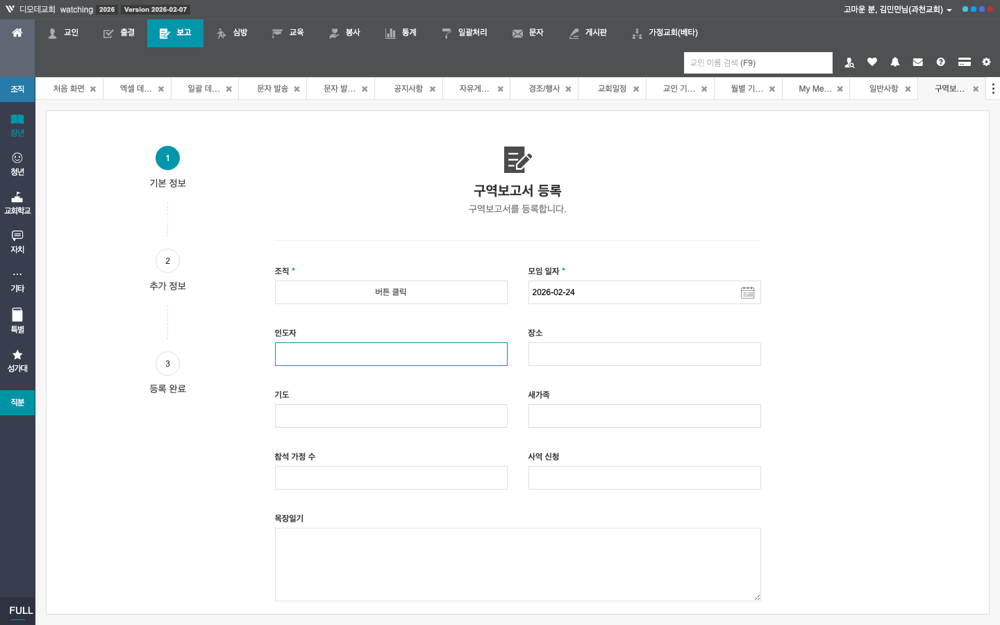

### 12.3 구역보고서 조회

연도·조직·모임 일자·교인 구분 조건으로 등록된 구역보고서 목록을 검색하고 조회합니다.

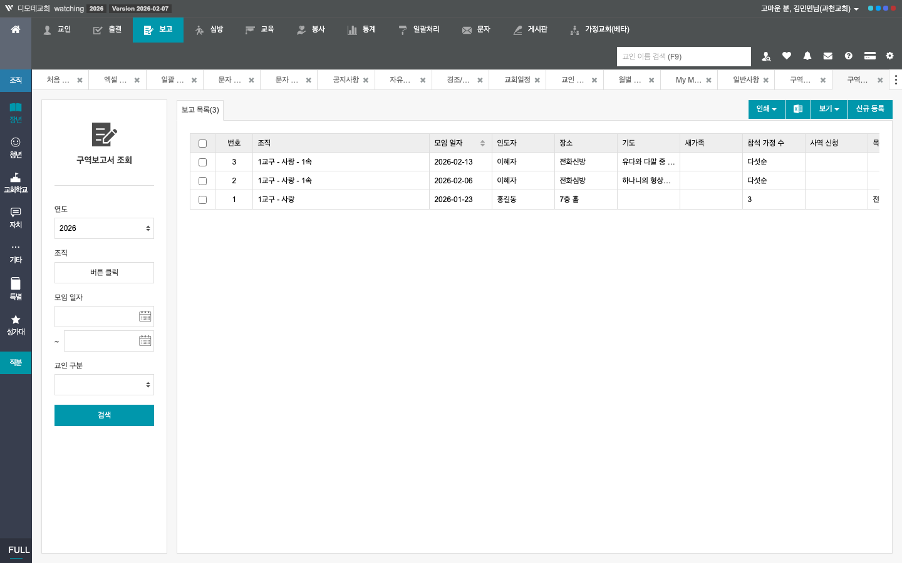

### 12.4 목원은사 등록

목원의 은사 종류와 대상자를 선택하고 메모를 입력하여 목원의 은사 정보를 등록합니다. 교인의 은사를 파악하여 적합한 봉사·사역에 배치하는 데 활용됩니다.

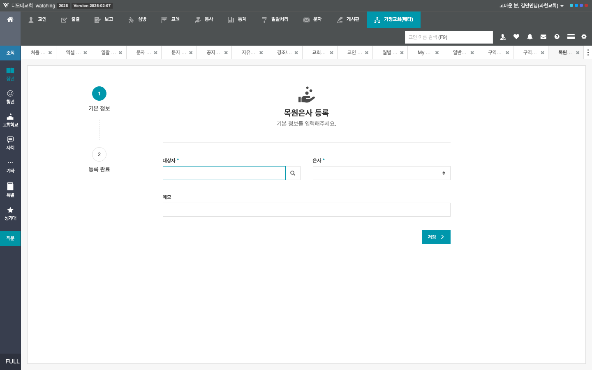

### 12.5 목원은사 조회

은사, 대상자, 조직 조건으로 등록된 목원 은사 목록(사진·조직·직책·은사·메모)을 검색하고 조회합니다.

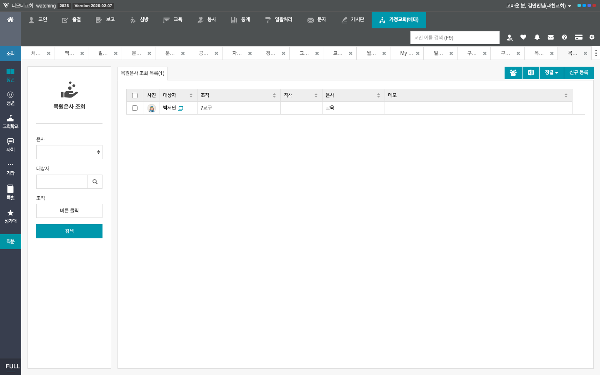

---

## 13. 프로그램 설정

시스템 전반의 운영 환경을 관리하는 메뉴입니다. 교회 기본 정보, 교인 검색 기준, 조직 구조, 교육 과정 정의, 코드성 항목 정의, 사용자 계정 관리, 그룹별 메뉴 접근 권한 설정을 포함합니다. 관리자만 접근 가능하며, 설정 변경 시 시스템 전반에 영향을 미칩니다.

> **접근 방법:** 처음 화면(홈)의 "프로그램 설정" 바로가기 클릭 또는 URL 해시 `#/setting/index` 로 직접 이동

### 13.1 설정 메인

일반 설정(교회 설정), 주요 설정(조직·교육·항목 정의 등), 교구사역 설정 항목을 카드 형태로 나열한 설정 진입 화면입니다.

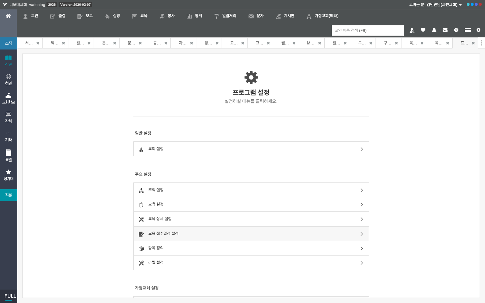

### 13.2 일반 설정 (교인 기준 설정)

이름 검색 기준, 교인·가족·부부·헌금 입력 검색 조건 기준, 자치 회원 기준, 교역자 기준 등 교인 조회 및 표시에 관한 기본 설정을 관리합니다.

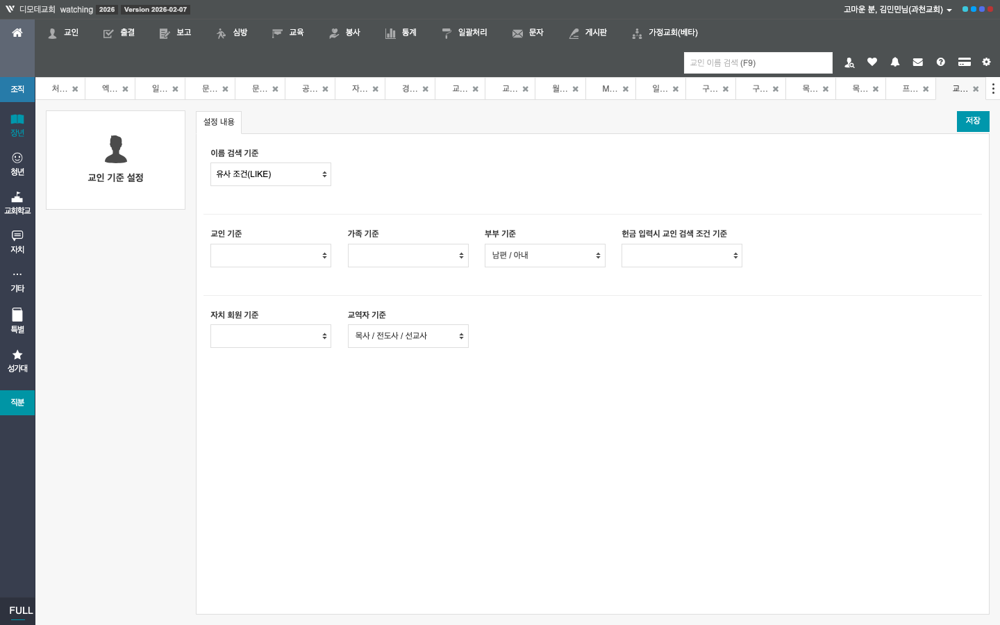

### 13.3 교회 설정

교단, 교회명, 담임목사, 주소, 홈페이지, 전화, 팩스, 납세번호 등 교회 기본 정보를 등록하고, 교회 로고·직인·소속 증명서 이미지를 업로드합니다.

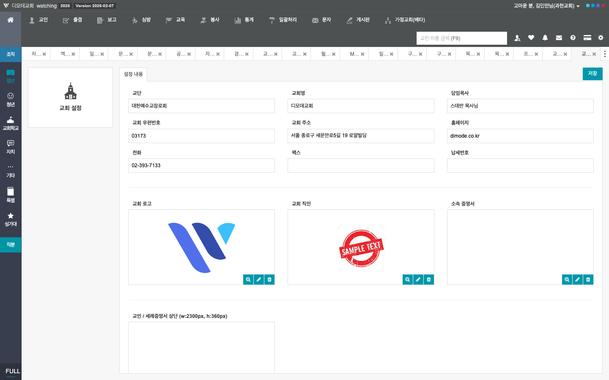

### 13.4 교육 설정

세례·제자훈련·기도훈련 등 단계별 교육 과정 항목을 추가·수정·삭제·순서 변경합니다. 여기서 정의된 항목이 교육 모듈의 교육명 목록으로 사용됩니다.

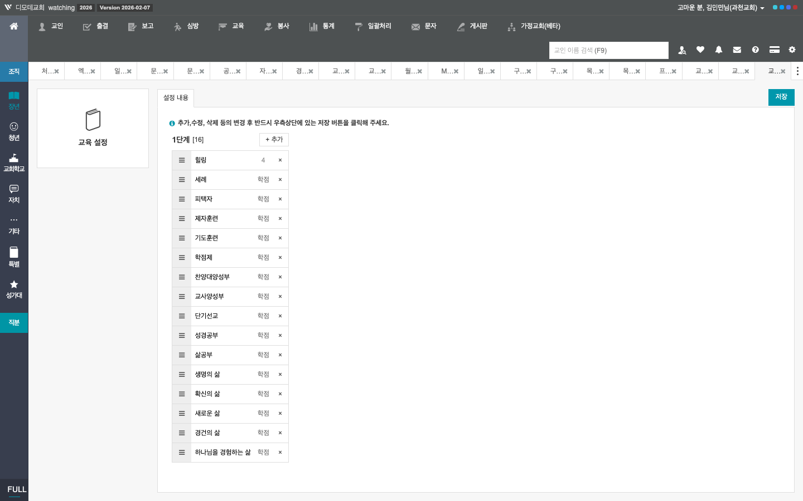

### 13.5 항목 정의

가족 관계, 결석 사유, 결혼 상태, 경조 행사 구분 등 시스템 전반에서 사용하는 코드성 항목값을 카테고리별로 추가·수정·삭제합니다.

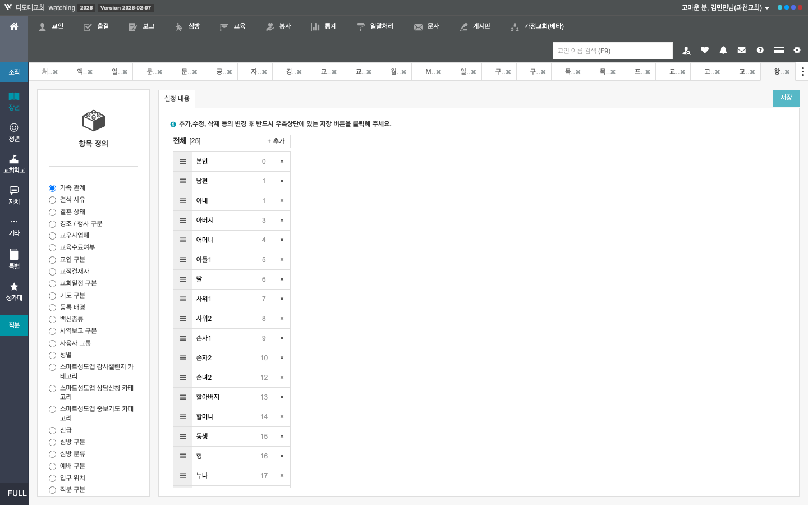

### 13.6 사용자 설정

시스템 사용자 목록(이름·아이디·사용자 그룹·관리 권한)을 조회하고 신규 사용자를 등록합니다. 사용자 그룹 배정을 통해 메뉴별 접근 권한을 제어합니다.

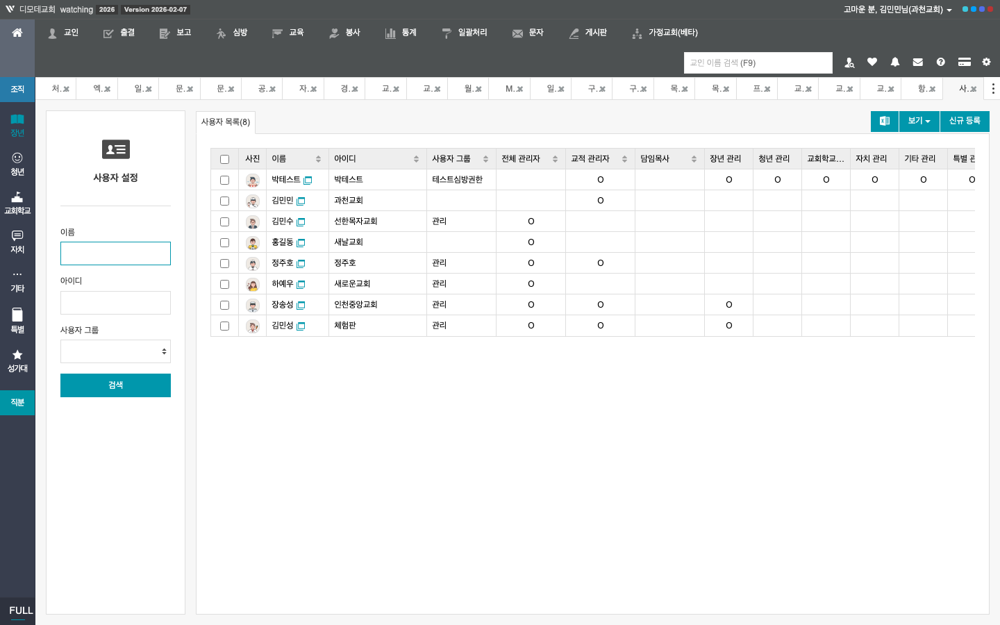

### 13.7 사용자 그룹 권한

교인·출결·보고·심방·교육·봉사·통계·일괄처리·문자·게시판·교구사역 등 메뉴별 기능 항목에 대한 사용자 그룹별 접근 권한을 매핑 테이블 형태로 관리합니다.

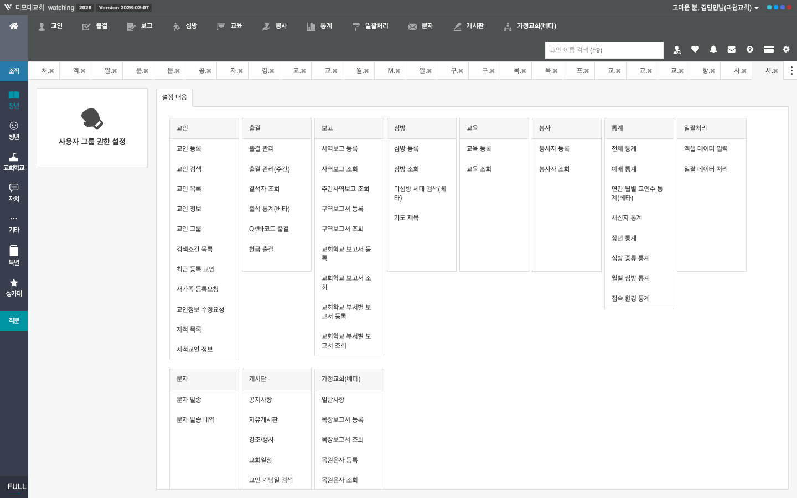

---

*본 보고서는 2026년 2월 24일 기준으로 과천교회 계정을 통해 캡처된 화면을 바탕으로 작성되었습니다.*
